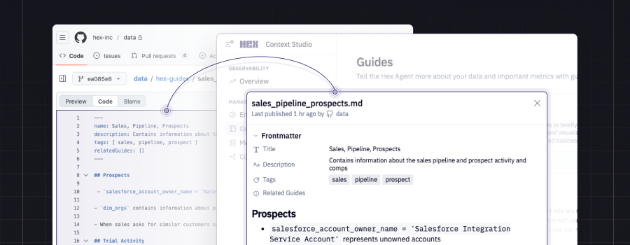

# Hex Action context toolkit

An action to upload external sources of context to [Hex](https://hex.tech) for use in the Hex Agent for [self-serve analytics](https://learn.hex.tech/docs/explore-data/threads).

This action currently supports uploading guide files, unstructured context that helps agents interpret questions and respond appropriately. Read [the docs](https://learn.hex.tech/docs/agent-management/context-management/guides#when-to-use-the-guide-library) on how to best utilize guide files in your Hex workspace. You can learn more about the types of context you can add to Hex in our agent management [docs](https://learn.hex.tech/docs/agent-management/context-management/overview).

## Features

- Selectively upload files in a larger repository
- Preview and test changes on GitHub Pull Requests
- Automatically reflect changes in Hex

## Usage

```yml
name: Publish Hex context

on:
  push:
    branches: ["main", "master"]
  pull_request:

permissions:
  contents: read
  pull-requests: write

jobs:
  publish_hex_context:
    runs-on: ubuntu-latest
    steps:
      - name: Checkout
        uses: actions/checkout@v6
      - name: Upload context resources
        uses: hex-inc/action-context-toolkit@v2
        env:
          GITHUB_TOKEN: ${{ github.token }}
        with:
          token: ${{ secrets.HEX_API_TOKEN }}
          comment_on_pr: true
```

### Inputs

`token`  
_Required._  
_A workspace token with the necessary scopes. This should be set in your GitHub repository settings in Secrets. This can be generated in your Hex Settings. The scopes are "Guides: Read, Guides: Write, Semantic layer sync", respective to what you are configuring._

`config_file`
_Optional. Defaults to_ `./hex_context.config.json`_._
The path to a `hex_context.config.json` file.

`hex_url`
_Optional. Defaults to_ `https://app.hex.tech`_._
For most Hex users, this will be `https://app.hex.tech`. For single tenant, EU multi tenant, and HIPAA multi tenant customers, replace `app.hex.tech` with your custom URL (e.g. `atreides.hex.tech`, `eu.hex.tech`).

`comment_on_pr`
_Optional. Defaults to_ `false`_._
Whether to comment on pull requests with a summary of changes and a link to the context preview. Requires a `GITHUB_TOKEN` in the environment variables and the `pull-requests: write` permission (otherwise, can be omitted).

## Configuration file

The action uses a `hex_context.config.json` file to configure the resources to upload. This file is used to define the paths to your guides and semantic projects.

### Guides

There are 2 different ways to point to guides: paths or patterns.

- `path` - the path to a single file.
  - `{ "path": "guides/arr.md" }`
  - Optionally, specify `"hexFilePath"` if you want the path that shows up in Hex to be different than how the file is structured in your repository.
- `pattern` - a glob that matches multiple files
  - `{ "pattern": "guides/*.md" }` matches all `.md` files directly inside a `guides` folder.
  - `{ "pattern": "guides/**/*.md" }` matches files in subdirectories.
  - Optionally, specify `"transform": { "stripFolders": true }` to rewrite the uploaded path to only include the file name, ignoring the folder path (e.g. `folder1/folder2/guide.md` becomes `guide.md`).

### Semantic projects

You can sync semantic project definitions from your repository. Each entry requires:

- `id` - the semantic project ID from your Hex workspace
- `path` - path to the directory containing the semantic model and view files

### Example config

```json
{
  "guides": [
    {
      "path": "path/to/my/guide.md"
    },
    {
      "path": "path_i_want_to_change.md",
      "hexFilePath": "path/that/will/show/up/in/hex.md"
    },
    {
      "pattern": "guides/*.md",
      "transform": {
        "stripFolders": true
      }
    },
    {
      "pattern": "guides/**/*.md"
    }
  ],
  "semanticProjects": [
    {
      "id": "<semantic-project-uuid>",
      "path": "path/to/dir"
    }
  ]
}
```

## Migrating from v1 to v2

The action now installs and uses the Hex CLI. No additional installation step is required.

Add a `"semanticProjects"` key to your Hex context configuration file following the [instructions](#semantic-projects) above.

(Breaking) The `publish_guides` input has been removed. Publishing now always occurs on push events to your default branch(es) (usually `main` or `master`). Existing workflows that omitted the input or set it to `true` will continue to work unchanged. A value of `false` is no longer supported.

(Breaking) The `delete_untracked_guides` input has been removed. Guide pruning is now always enabled. Existing workflows that omitted the input or set it to `true` continue to work unchanged. A value to `false` is no longer supported.
